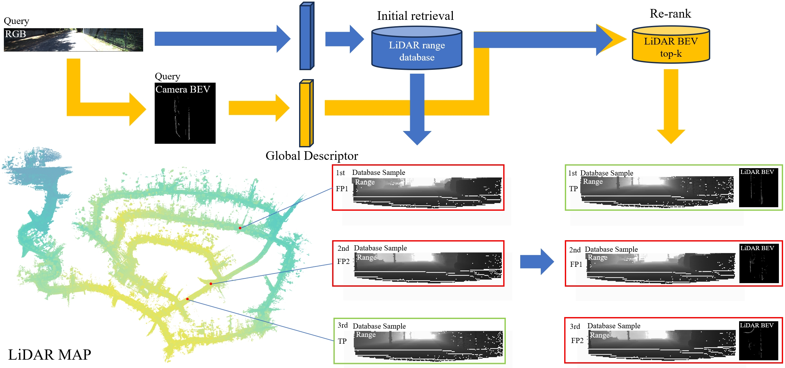
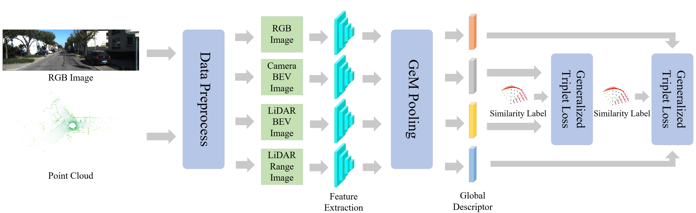
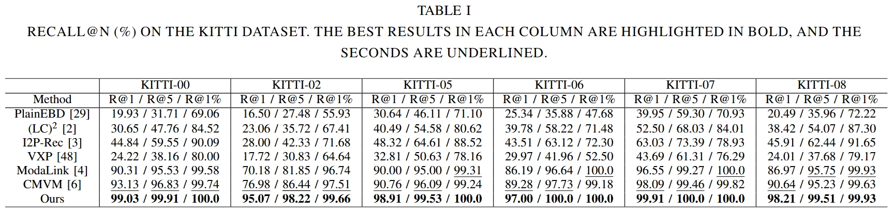
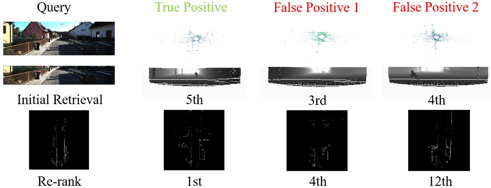

<p align="center" width="100%">
<a target="_blank"></a>
</p>

# Range and Bird's Eye View Fused Cross-Modal Visual Place Recognition

## 1) introduction
This repository contains the code for our proposed method "RangeBEV". the link of the paper is [Range and Bird's Eye View Fused Cross-Modal Visual Place Recognition](https://arxiv.org/abs/2502.11742)

We propose an innovative initial retrieval + re-rank method that effectively combines information from range (or RGB) images and Bird's Eye View (BEV) images. Our approach relies solely on a computationally efficient global descriptor similarity search process to achieve re-ranking. Additionally, we introduce a novel similarity label supervision technique to maximize the utility of limited training data. 

Experimental results on the KITTI dataset demonstrate that our method significantly outperforms state-of-the-art approaches.

### 1、pipeline

### 2、quantitative results

### 3、qualitative results


## 2) Get started
### 1、Environment Setup
We use PyTorch and the MMSegmentation Library. We acknowledge their great contributions!
```bash
conda create -yn RangeBEV python=3.8
conda activate RangeBEV
pip install -r requirements.txt
```
if you encounter problems with installing [mmsegmentation](https://github.com/open-mmlab/mmsegmentation), [MinkowskiEngine](https://github.com/NVIDIA/MinkowskiEngine), [faiss](https://github.com/facebookresearch/faiss), [open3d](https://github.com/isl-org/Open3D), [vision3d](https://github.com/qinzheng93/vision3d), etc., please refer to the official websites for help.

### 2、Download Datasets
#### KITTI Odomety dataset
You should firstly login the [KITTI official website](https://www.cvlibs.net/datasets/kitti/index.php) and then download the odometry dataset. Download the "color", "velodyne laser data", "calibration files" and "ground truth poses" .zip files. Unzip them into a folder structure according to the official guide.

#### SemanticKITTI dataset
Then you need to download the SemanticKITTI label data from the [official website](https://semantic-kitti.org/dataset.html), which will be used as the ground truth for training model on 11~21 sequences.

#### Boreas dataset
Additionally, if you want to run the model on the Boreas dataset, you can download it from the [official website](https://www.boreas.utias.utoronto.ca/#/). The demanding sequences are in the datasets/Boreas_dp/mv_boreas_minuse.py and only the LiDAR and the Camera sensor data are required.